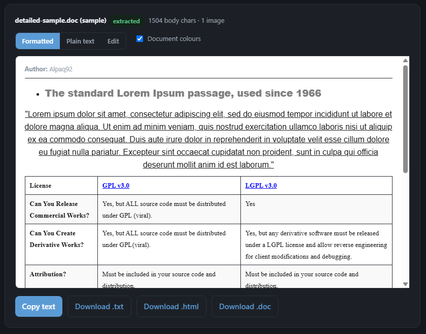

# JSDoc

[](https://github.com/Alpaq92/JSDoc/actions/workflows/ci.yml)
[](https://github.com/Alpaq92/JSDoc/actions/workflows/ci.yml)
[](https://alpaq92.github.io/JSDoc/)
[](LICENSE)

**Reads — and writes — legacy Microsoft Word `.doc` files** (Word 97–2003, the old binary OLE2 format), right in the browser, no dependencies. Built clean-room from Microsoft's published specs, so it ships under `0BSD` — no GPL tooling (catdoc, antiword) anywhere near it.

```js
docToText(input)          // → body text (string), or null if it can't be read
docToText.sections(input) // → { body, footnotes, headers, … } — text of each story
docToText.html(input)     // → styled HTML per story
docToText.model(input)    // → styled paragraph/run model (feeds the writer)
docToText.images(input)   // → [{ mime, bytes }] — embedded PNG/JPEG
textToDoc(input)          // → Uint8Array — write a .doc back (string or a styled model)
```

`input` is an `ArrayBuffer`, `Uint8Array`, or Node `Buffer`. `docToText` returns `null` for anything it won't touch (Word 6/95, encrypted, not a `.doc`, corrupt) — your cue to fall back to a download link. `textToDoc` is the inverse, so a document round-trips: `textToDoc(docToText.model(buf))`.

## Try it

**▶ Live demo: <https://alpaq92.github.io/JSDoc/>**



[`index.html`](index.html) is a no-build demo — drop a `.doc` on the page (or hit **Try a sample**) and it's parsed locally, nothing uploaded. Three views (**Formatted**, **Plain text**, **Edit**) plus **Download** as `.txt`, `.html`, or a real `.doc`. Serve the folder (`npx serve`, `python -m http.server`) or deploy to GitHub Pages — the bundled [`samples/`](samples/) mean it needs no network.

## Usage

```html
<script src="src/docToText.js"></script>
<script>
  const buf = await (await fetch('/file.doc')).arrayBuffer();
  const text = docToText(buf);                 // UMD global in the browser
  text === null ? showDownloadLink() : showText(text);
</script>
```

```js
const docToText = require('./src/docToText.js');   // plain require in Node
docToText(require('fs').readFileSync('file.doc'));
```

## Reading

`docToText()` returns the body text — smart quotes and non-Latin scripts intact, field codes stripped to their result, **list markers synthesized** (`1.` / `a)` / `i.` / `•`, counted per level from the list definition, since Word keeps them out of the text stream — even when a paragraph's list membership lives in its *style* rather than a direct property, as Word's built-in numbered headings do), and **tracked changes accepted** (deletions dropped, insertions kept). The richer views resolve formatting through the stylesheet, so formatting that lives in a *style* — a heading's bold, a link's blue/underline — isn't lost:

- `docToText.sections()` — the other stories (footnotes, endnotes, comments, headers/footers, text boxes) as separate strings.
- `docToText.html()` / `docToText.model()` — full character styling, lists, tables, links, and images. The model feeds the writer.
- `docToText.images()` — embedded PNG/JPEG, carved by signature.

**Not handled:** WMF/EMF metafiles (only PNG/JPEG are extracted — rendering them needs a heavy, non-permissive converter) and exact page layout (line/page-break positions need a real layout engine). In *plain text* tables flatten to tab-separated rows; the model and Formatted view keep the real cell structure.

## Writing

`textToDoc(input)` ([src/textToDoc.js](src/textToDoc.js)) writes a Word 97–2003 binary `.doc` and returns a `Uint8Array`. `input` is a plain string or a styled model from `docToText.model()`, so formatting round-trips.

A `.doc` built entirely from spec round-trips through lenient parsers but **real word processors reject it** — they require a valid stylesheet, section table, and property tables, and getting every one right blind is the wall (Apache POI doesn't build one from scratch either). So the writer **injects** content into a tiny **bundled blank-document skeleton** — a genuine app-saved empty `.doc`, stripped to its structural streams — reusing those structures and swapping in the text, piece table, and freshly built property pages. Pass your own blank `.doc` as a second argument to use a different skeleton.

It round-trips:

- **Paragraphs** — alignment, spacing & indentation, line spacing, keep-with-next / keep-together / page-break-before, tab stops (with leaders), shading, box borders, and **bullet & numbered lists** (the writer synthesizes the list tables, so numbered items come back out as `1.` `2.` `3.`).
- **Characters** — bold, italic, underline (single / double / dotted / wavy), strike, super/subscript, small caps, all caps, hidden, size, colour, highlight, and font.
- **Tables** — column widths, horizontal **and** vertical cell merges, per-cell shading, and empty cells.
- **Stories** — footnotes, endnotes, comments, headers/footers, and text boxes (all six can coexist in one document).
- **Document** — page setup (margins, size, landscape, columns), document properties, bookmarks, inline images, and live hyperlinks.


*[`samples/feature-showcase.doc`](samples/feature-showcase.doc) — every feature in one document, written by `textToDoc`, read back by `docToText`, rendered by the demo. Regenerate with `node scripts/build-sample.js`.*

Each is checked three ways: read back by `docToText`, cross-checked against the unrelated [`word-extractor`](https://github.com/morungos/node-word-extractor) ([test/styled.test.js](test/styled.test.js)), and — since lenient parsers were the whole problem — confirmed to open in a real word processor (SoftMaker TextMaker, driven through its COM automation).

## How it works

Two layers, both straight from the spec:

1. **Container** ([MS-CFB](https://learn.microsoft.com/en-us/openspecs/windows_protocols/ms-cfb/53989ce4-7b05-4f8d-829b-d08d6148375b)) — a `.doc` is an OLE2 compound file, a little FAT-style filesystem. Parse the header, follow the sector chains, pull out the `WordDocument` and table streams.
2. **Text** ([MS-DOC](https://learn.microsoft.com/en-us/openspecs/office_file_formats/ms-doc/ccd7b486-7881-484c-a137-51170af7cc22)) — read the FIB to locate the piece table, then walk the pieces decoding each as Windows-1252 or UTF-16, per the [§2.4.1 "Retrieving Text"](https://learn.microsoft.com/en-us/openspecs/office_file_formats/ms-doc/01d5d8c4-cf9c-4ef9-80fd-439e763cfe01) algorithm. The 8-bit encoding [isn't quite cp1252](https://learn.microsoft.com/en-us/openspecs/office_file_formats/ms-doc/aa2e55a2-f4f2-4795-bab5-6d9d7a0ed249) — the spec remaps 24 bytes, copied verbatim, so `0x80`/`0x8E`/`0x9E` decode the way Word means.

Both specs are free under Microsoft's [Open Specification Promise](https://go.microsoft.com/fwlink/?LinkId=214445), which expressly allows copying them to build an implementation — that's what makes a clean-room `0BSD` build legitimate, rather than porting GPL tools like catdoc or antiword (which were never read).

## Tests

```bash
npm test            # offline, no dependencies
npm run test:oracle # diff against word-extractor on real .doc files
```

`npm test` builds a spec-valid `.doc` in memory and checks the result against a known answer — both storage paths, both encodings, field codes, the graceful-`null` cases, and full read/write round-trips. `npm run test:oracle` diffs our output against [word-extractor](https://github.com/morungos/node-word-extractor) (MIT, used only for comparison, never copied) across 15 real Word files.

## License

[`0BSD`](LICENSE) — public-domain-equivalent, no attribution required, so it can live anywhere.

The bundled samples carry only public-domain Lorem Ipsum or generated content. The writer's **skeleton** and inline-picture bytes are reverse-engineered from blank documents saved by a real word processor (SoftMaker FreeOffice), reduced to structural bytes with no authored content (regenerate via [`scripts/embed-template.js`](scripts/embed-template.js)). `word-extractor` (MIT) is a dev-only test dependency, not part of the shipped code.
